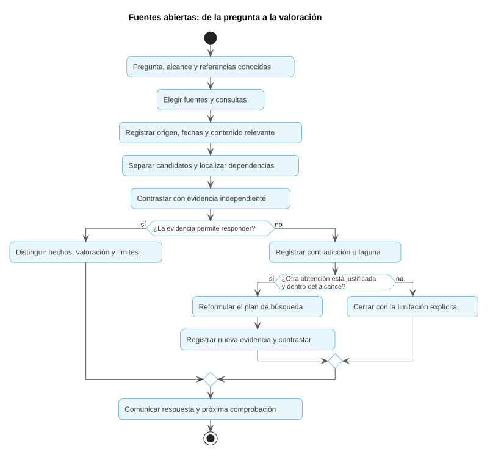

# OSINT: personas y organizaciones

## Una primera aproximación

Una empresa recibe una petición para cambiar el canal de gestión de pagos de un proveedor. El mensaje utiliza su logotipo, cita el nombre de una persona de su equipo y enlaza a una página que parece oficial. ¿Basta con que esos elementos coincidan para aceptar la petición?

El trabajo con fuentes abiertas permite comprobar relaciones, fechas y contradicciones. Su resultado debe responder a una pregunta concreta: en este ejemplo, si la información disponible sostiene que el mensaje procede del proveedor y qué falta comprobar antes de cambiar el pago.

**OSINT** significa *Open Source Intelligence*, inteligencia de fuentes abiertas. Una fuente abierta es información a la que se puede acceder por medios permitidos: publicaciones, registros, páginas web o documentos públicos. Recogerla es solo el primer paso; para producir inteligencia hay que verificarla, interpretarla y relacionarla con una decisión.

| Lo que encontramos | Qué debemos comprobar | Qué puede aportar |
|---|---|---|
| Una página con el logotipo de una empresa | Quién controla la página y desde dónde se enlaza | Una posible relación con la organización |
| Un perfil que declara un puesto | Si existe corroboración y si el dato sigue vigente | Una relación profesional con reservas |
| Varias noticias con la misma afirmación | Si proceden de fuentes distintas o copian una sola | Corroboración o simple repetición |
| Una captura de una publicación | Su origen, fecha y contexto | Evidencia limitada de un contenido |

El caso [**Operación Prisma**](casos/operacion-prisma/README.md) aplica estos conceptos a una petición que Velaria Eventos recibe de su supuesto proveedor Náyade Servicios Digitales. Sus documentos permiten preparar preguntas, comparar herramientas y valorar evidencias.

## OSINT ético y uso malicioso de fuentes abiertas

Los mismos datos públicos pueden utilizarse para proteger una organización o para perjudicarla. En este tema llamamos **OSINT ético** a la obtención y análisis con una finalidad legítima, dentro del alcance permitido y con minimización de datos. Hablamos de **uso malicioso** cuando esa información se aprovecha para suplantar, acosar, engañar o preparar un ataque.

La diferencia no está en que una herramienta sea buena o mala. Importan la finalidad, la autorización, la forma de obtener los datos y el uso del resultado. Que un dato sea público no autoriza cualquier tratamiento, como se explicó en el Tema 2.

| Información visible | Cómo podría aprovecharla un atacante | Uso defensivo y proporcionado |
|---|---|---|
| Marca y logotipo | Dar apariencia conocida a una petición | Comprobar dominio y canal por referencias previas |
| Nombre y función profesional | Hacer creíble una firma o una petición | Verificar únicamente la relación necesaria |
| Aviso sobre un cambio de servicio | Construir un pretexto con contexto real | Contrastar la publicación original y la fecha |
| Imagen de un evento | Reutilizarla como supuesta prueba reciente | Buscar usos anteriores y revisar contexto |

**Pensar desde el lado del atacante** significa preguntar qué dato le ahorra trabajo y qué decisión podría intentar influir. Después se transforma esa observación en una comprobación o una medida de protección. No hay que ejecutar el engaño para comprenderlo.

Ejemplo: un nombre y un cargo hacen plausible una firma; la defensa no consiste en recopilar la vida de esa persona, sino en comprobar si el mensaje procede de un canal validado y si el cambio está autorizado.

**Caso:** abre [Prisma · Uso ético y perspectiva del atacante](casos/operacion-prisma/00-uso-etico-y-perspectiva-del-atacante.md). Clasifica las acciones con las muestras del expediente, sin instalar herramientas ni buscar en Internet.

## Fundamentos de OSINT y metodología de footprinting

### De la pregunta al plan de búsqueda

El Tema 1 enseñó a formular el requerimiento y el Tema 2 fijó los límites de la obtención. Ahora se eligen las fuentes que pueden responder a cada pregunta.

| Pregunta en Operación Prisma | Fuente adecuada | Límite |
|---|---|---|
| ¿Cuál es el dominio conocido del proveedor? | Documentación previa de la relación comercial y web corporativa | Una página nueva puede copiar la identidad visual |
| ¿Qué relación profesional consta para la firmante? | Página de equipo, perfil profesional y programa de un evento | No investigar su vida personal |
| ¿Hay un cambio de canal anunciado? | Avisos corporativos y publicaciones originales | Un repost no confirma que el cambio esté autorizado |
| ¿La empresa existe con ese nombre? | Documentación societaria y registros públicos | Existir como sociedad no autentica el mensaje |

Una consulta útil tiene un propósito que se puede escribir en una línea. Si no permite resolver una pregunta del requerimiento, se descarta.

### Qué significa footprinting

*Footprinting* es reconocer la huella pública de un objetivo: nombres, dominios, documentos, canales y relaciones que pueden observarse desde fuera. En este tema interesa la huella de la organización y las relaciones profesionales necesarias para entenderla. El Tema 4 tratará su infraestructura técnica.

No consiste en recopilar todo lo que aparezca. El resultado es un mapa de referencias pertinentes, cada una con su origen, fecha y relación con la pregunta. Una pista puede ampliar el mapa; para convertirse en un hecho necesita contraste.

| Huella | Datos que pueden aparecer | Pregunta que ayuda a responder | Límite |
|---|---|---|---|
| Profesional | Nombre, puesto, perfil y participación en eventos | ¿Qué relación profesional está documentada? | El puesto puede haber cambiado |
| Corporativa | Nombre legal, marcas, filiales y registros | ¿Qué entidad presta el servicio? | Marca y sociedad no son equivalentes |
| Documental | Informes, avisos y publicaciones fechadas | ¿Qué se publicó y cuándo? | Publicación no equivale a verificación |
| De canales | Dominios y perfiles enlazados por referencias conocidas | ¿Qué canal presenta la organización? | El logotipo se puede copiar |
| Técnica | DNS, certificados y servicios observados | ¿Qué infraestructura se relaciona con el objetivo? | Compartir proveedor no demuestra propiedad |

En Prisma, el punto de partida es el dominio de la relación comercial previa. Desde él se comparan el perfil enlazado, el canal propuesto y el origen del anuncio. Buscar familiares de la firmante no aporta una respuesta al encargo.



1. **Acotar.** Escribir pregunta, objetivo, periodo y exclusiones.
2. **Partir de referencias conocidas.** Conservar el nombre legal, dominio o documento que ya se haya validado.
3. **Buscar.** Elegir consultas y fuentes por su utilidad para la pregunta.
4. **Registrar.** Anotar consulta, fuente, fecha de consulta y evidencia relevante.
5. **Contrastar.** Buscar el origen de la afirmación y otra fuente independiente.
6. **Valorar.** Separar lo observado, lo deducido y lo que falta.
7. **Cerrar o reformular.** Detener la búsqueda cuando se puede responder o cuando el límite impide avanzar.

El recorrido vuelve hacia atrás si aparece una contradicción. No obliga a encontrar una respuesta afirmativa: «la relación no está confirmada» también puede apoyar una decisión.

### Buscar con precisión

Los buscadores permiten acotar la consulta. Estos ejemplos muestran cómo escribirla; los nombres y dominios son ficticios y no deben producir resultados reales.

| Consulta de ejemplo | Propósito |
|---|---|
| `"Náyade Servicios Digitales"` | Buscar el nombre completo, evitando coincidencias parciales |
| `site:nayade.example "equipo"` | Localizar páginas indexadas del sitio conocido |
| `site:nayade.example filetype:pdf` | Localizar documentos PDF indexados de ese dominio |
| `"Náyade Servicios Digitales" -"oferta de empleo"` | Reducir resultados que no responden a la pregunta |
| `"Marta Vega" "Náyade"` | Buscar una relación profesional declarada, dentro del alcance |

Las comillas, `site:`, `filetype:` y el signo menos se explican en la [ayuda oficial de Google](https://support.google.com/websearch/answer/2466433?hl=es). La sintaxis y el comportamiento varían entre buscadores.

El apartado [Google: operadores y búsquedas combinadas](herramientas.md#google-operadores-y-búsquedas-combinadas) reúne la sintaxis, los filtros de fecha y ejemplos sobre fuentes públicas reales.

Un resultado de búsqueda es una pista. El fragmento puede estar recortado o desactualizado; hay que consultar la fuente si el alcance lo permite. Tampoco se puede concluir que algo no existe porque el buscador no lo encuentre: puede no estar indexado, haber cambiado de nombre o requerir otra consulta.

### Obtención, interacción y registro

Consultar un índice o una copia ya facilitada evita visitar directamente la página del objetivo. Abrir su web envía solicitudes que pueden quedar registradas. Seguir un perfil, enviar un mensaje, unirse a un grupo o rellenar un formulario implica interacción y necesita un alcance que la permita.

El expediente contiene muestras ficticias. La obtención utiliza el objetivo público indicado en el apartado del caso, sin buscar los nombres inventados. Los resultados conservan su objetivo real y no se presentan como evidencias sobre Velaria o Náyade.

| Entrada de bitácora | Ejemplo |
|---|---|
| Pregunta | Comprobar cuál es el canal público conocido del proveedor |
| Fuente | PRI-F01, página corporativa incluida en el expediente |
| Acción | Revisar la sección de contacto y el enlace al perfil corporativo |
| Resultado | Declara `nayade.example` y enlaza al perfil `@nayade_oficial` |
| Decisión siguiente | Comparar con el dominio de la petición; no atribuir todavía su autoría |

El primer apartado del caso, [De la pregunta a la búsqueda](casos/operacion-prisma/01-pregunta-y-busqueda.md), permite preparar el plan antes de revisar todas las muestras.

## Herramientas disponibles y criterios de elección

Las plataformas OSINT tienen funciones distintas. Maltego permite organizar y ampliar relaciones; Babel X y la oferta actual de Babel Street ayudan a buscar y seguir información multilingüe; Hunchly conserva evidencias. Lens, TinEye, Wayback y fuentes como BORME responden a preguntas más concretas.

Consulta [Herramientas OSINT para personas y organizaciones](herramientas.md). Cada apartado explica qué hace la herramienta, qué devuelve, cuándo resulta útil y qué límites tiene. Las capturas proceden de documentación publicada y llevan su referencia.

| Para elegir | Pregunta |
|---|---|
| Necesidad | ¿Qué afirmación necesito comprobar? |
| Fuente | ¿La herramienta consulta una fuente pertinente? |
| Resultado | ¿Devuelve contenido, una relación, una fecha o una captura? |
| Alcance | ¿Qué datos enviará y qué acciones realizará? |
| Recursos | ¿Tengo acceso y compensa su uso para este volumen? |
| Verificación | ¿Puedo remontarme al origen del resultado? |

**Caso:** completa [Prisma · Elección de herramientas](casos/operacion-prisma/02-eleccion-de-herramientas.md). Compara opciones, descarta una y justifica la mejor para cada pregunta. Este apartado se resuelve sin consultas.

## De la elección a la obtención

Una herramienta elegida debe producir un resultado verificable. En la siguiente parte se registra la consulta, la fuente, la fecha, el contenido relevante y el límite. Si la opción elegida no está disponible, se explica el cambio y se utiliza una alternativa que responda a la misma pregunta.

**Caso:** continúa en [Prisma · Obtención con herramientas](casos/operacion-prisma/03-obtencion-con-herramientas.md). Aquí se utiliza la elección anterior. Después se vuelve a la teoría para revisar identidades, publicaciones y fuentes; más resultados no significan mejores conclusiones.

## Investigación de personas: identidad y huella digital

### Separar nombre, cuenta y persona

Una identidad digital es la representación con la que alguien aparece en un servicio. Puede incluir un nombre visible, un alias, una imagen y una descripción. La **huella digital** reúne lo que esa persona publica y lo que otras fuentes publican sobre ella. Parte de la huella puede ser antigua, incorrecta o pertenecer a otra persona con el mismo nombre.

| Concepto | Qué es | Ejemplo de Prisma | Cómo se distingue |
|---|---|---|---|
| Nombre | Texto que sirve para nombrar | «Marta Vega» | Puede repetirse entre personas y cuentas |
| Alias o identificador | Referencia de una cuenta dentro de un servicio | `@marta_nayade_pagos` | Se conserva junto con plataforma y URL; no es un identificador universal |
| Cuenta | Objeto creado en una plataforma | PRI-P03 | Puede cambiar de nombre, ser compartida o quedar comprometida |
| Persona | Individuo al que se atribuye una actividad | La profesional mencionada en la petición | Su relación con una cuenta requiere evidencia |
| Identidad digital | Forma en que una cuenta o conjunto de cuentas se presenta | Nombre, foto y puesto declarados en PRI-P03 | La presentación puede ser correcta, inventada o copiada |
| Huella digital | Rastros publicados por el sujeto o por terceros | Perfil, programa del evento y menciones fechadas | Se separan por procedencia, fecha y candidato |

Una persona puede utilizar varias cuentas y una cuenta puede tener varios administradores. Ver el mismo nombre o fotografía no permite resolver ninguna de esas relaciones. En el informe se escribe «la cuenta declara…» hasta disponer de evidencia para atribuirlo a una persona.

| Elemento | Qué permite afirmar | Qué no demuestra |
|---|---|---|
| Nombre visible | La cuenta utiliza ese texto | La identidad de quien la controla |
| Alias | Ese identificador aparece en un servicio | Que el mismo alias en otro servicio tenga el mismo titular |
| Fotografía | La imagen está publicada en el perfil | Que represente a su titular o sea original |
| Puesto declarado | La cuenta afirma una relación profesional | Que la relación sea real o siga vigente |
| Enlace desde una web corporativa conocida | La organización presenta o enlaza ese perfil | Que cualquier mensaje con su nombre proceda de él |

**La coincidencia de un nombre genera un candidato; no confirma una identidad.**

### Comparar sin unir por intuición

En Operación Prisma hay tres perfiles con el nombre Marta Vega. Dos declaran trabajar en Náyade; el tercero en una organización distinta. Compartir nombre o puesto no permite reunir sus publicaciones en una ficha única.

| Comprobación | Ejemplo | Valor para el análisis |
|---|---|---|
| Relación profesional | Página de equipo y perfil declaran el mismo puesto | Compatibilidad, con posible origen común |
| Enlace explícito | La web corporativa enlaza al identificador del perfil | Relación documental más concreta |
| Referencia externa fechada | Un programa de un evento incluye persona y empresa | Corrobora la relación en esa fecha |
| Contradicción | Otro perfil declara una empresa y trayectoria distintas | Obliga a mantener separados los candidatos |
| Ausencia de evidencia | No hay enlace al perfil que firma la petición | La relación permanece sin confirmar |

No se suman coincidencias como si cada una aportara una prueba independiente. Un nombre, una foto y una biografía copiados de la misma página siguen teniendo un único origen posible. La conclusión debe indicar qué relación se sostiene y para qué fecha.

### Recoger lo necesario

Para comprobar una firma profesional puede bastar con el nombre, puesto, organización, enlace y fecha relevantes. No hacen falta dirección personal, familiares, aficiones, horarios ni un historial completo de publicaciones. Tampoco se intenta averiguar la identidad civil de un alias.

El caso propone redactar una conclusión acotada en [Identidad y huella profesional](casos/operacion-prisma/04-identidad-y-huella.md). El objetivo es comprobar relaciones útiles para la petición, dentro de los límites del Tema 2.

## SOCMINT: investigación en redes sociales

**SOCMINT** significa *Social Media Intelligence*: análisis de información de redes sociales para responder a una necesidad de inteligencia. Puede trabajar con cuentas, publicaciones, enlaces y secuencias temporales. En esta asignatura se limita a las muestras facilitadas o a publicaciones públicas expresamente autorizadas.

### Una cuenta, una publicación y una afirmación

Son tres objetos distintos. Una cuenta auténtica puede publicar información errónea. Una cuenta falsa puede copiar información correcta. Una publicación real puede reutilizar una imagen fuera de contexto.

| Objeto | Qué es | Ejemplo del expediente | Qué se verifica |
|---|---|---|---|
| Cuenta | Perfil desde el que se difunde contenido | PRI-P03, perfil que declara gestionar pagos | Identificador, enlaces y relación con el proveedor |
| Publicación | Pieza concreta, con contenido y fecha | PRI-S01, anuncio del cambio | URL original, fecha, edición y material incorporado |
| Afirmación | Proposición que puede ser verdadera o falsa | «El proveedor ha autorizado el nuevo canal» | Evidencia de la autorización, con origen y fecha |

El expediente acredita que una cuenta publicó un anuncio; no acredita por ello que el proveedor autorizase el cambio. Cada afirmación de una misma publicación se evalúa por separado: una imagen puede ser auténtica y su descripción incorrecta.

Para verificar una publicación conviene reconstruir una secuencia sencilla:

1. Localizar el original o indicar que no se dispone de él.
2. Registrar autor o cuenta, enlace, fecha de publicación y fecha de consulta.
3. Distinguir el contenido original de comentarios, recortes y republicaciones.
4. Comparar la fecha del contenido mostrado con la fecha del hecho que se afirma.
5. Buscar corroboración que no dependa de esa misma publicación.
6. Escribir qué se confirma y qué sigue pendiente.

La [guía de verificación de Bellingcat](https://www.bellingcat.com/resources/2021/11/01/a-beginners-guide-to-social-media-verification/) muestra cómo imágenes y vídeos auténticos pueden circular con una explicación equivocada. La búsqueda inversa de imágenes ayuda a localizar usos anteriores; no identifica por sí sola al autor ni garantiza encontrar la primera publicación. Solo se emplea con imágenes que se puedan compartir con el servicio elegido.

### Búsqueda inversa de imágenes y fotogramas

Una búsqueda de texto parte de palabras. La **búsqueda inversa** parte de una imagen para localizar copias, versiones parecidas o páginas que la contienen. En SOCMINT ayuda a comprobar si el material ya circulaba y si la fecha, el lugar o el hecho que se le atribuyen coinciden con su contexto anterior.

| Situación | Procedimiento | Qué puede aportar |
|---|---|---|
| Una foto se presenta como tomada hoy | Consultar la imagen completa y abrir coincidencias anteriores | Un uso anterior que contradiga su presentación como nueva |
| Una imagen está recortada o tiene texto añadido | Repetir con un recorte del elemento reconocible | Una versión sin rótulos o con más contexto |
| Un vídeo se presenta como un hecho reciente | Extraer varios fotogramas distintos y buscarlos como imágenes | Coincidencias con otra publicación del vídeo |
| Solo aparecen imágenes parecidas | Comparar edificios, objetos y encuadre antes de relacionarlas | Pistas; la similitud no acredita una copia |

1. Escribe qué quieres comprobar: antigüedad, contexto o coincidencia.
2. Conserva la publicación de partida y su imagen o fotograma, dentro del alcance permitido.
3. Consulta Lens o TinEye. Si hay rótulos o bordes, compara también un recorte; conserva el original.
4. Abre la página que contiene cada coincidencia útil. El resultado del buscador no basta.
5. Separa fecha de publicación, fecha atribuida al hecho y fecha de consulta. «Más antigua encontrada» no significa «primera publicación de la historia».
6. Describe qué relación se sostiene y qué queda pendiente. No encontrar coincidencias deja una laguna.

**Ejemplo real: un vídeo de 2012 presentado como combates de 2016.** Bellingcat documentó en su guía del 30 de junio de 2017 que imágenes de unas maniobras militares rusas de 2012 se difundieron como combates cerca de Svitlodarsk en diciembre de 2016. La búsqueda inversa descrita no encontraba fácilmente el original: también hicieron falta pistas del contenido y búsqueda contextual. [Fuente y ejemplos del análisis](https://www.bellingcat.com/resources/how-tos/2017/06/30/advanced-guide-verifying-video-content/).

Este ejemplo enseña dos límites: una grabación auténtica puede acompañar una afirmación falsa y una búsqueda inversa sin coincidencias no valida esa afirmación. En Prisma, PRI-F06 y PRI-S05 permiten comprobar el uso anterior de IMG-01. Continúa con [Publicaciones y contexto](casos/operacion-prisma/05-publicaciones-y-contexto.md).

### Leer fechas y relaciones

| Error frecuente | Forma de corregirlo |
|---|---|
| Tratar un repost como una segunda confirmación | Registrar de qué publicación depende |
| Usar la hora de una captura como hora del hecho | Separar publicación, hecho y obtención |
| Interpretar seguidores como empleados o cómplices | Describir únicamente la relación visible |
| Tomar la insignia de una plataforma como garantía del mensaje | Comprobar enlaces y evidencias de la relación concreta |
| Convertir muchas repeticiones en alta confianza | Contar fuentes independientes, no publicaciones |
| Dar por actual una foto republicada hoy | Revisar su primera aparición disponible y el contexto |

Conservar la zona horaria evita cronologías falsas. `09:10Z` significa 09:10 UTC; una interfaz puede mostrar otra hora según su configuración. Si la fecha original se desconoce, se escribe «no consta».

En el caso, un anuncio y dos republicaciones apuntan al mismo canal. La [verificación de las publicaciones](casos/operacion-prisma/05-publicaciones-y-contexto.md) permite comprobar por qué esas tres piezas no son tres confirmaciones.

## Investigación de organizaciones y verificación de fuentes

### Construir una ficha útil

Una organización puede tener nombre legal, marca comercial, varias filiales, dominios y proveedores. Es necesario separar esas piezas antes de relacionarlas.

| Campo | Fuente posible | Precaución |
|---|---|---|
| Nombre legal y marca | Aviso legal y documentación societaria | Dos marcas parecidas pueden ser entidades distintas |
| Existencia y actos societarios | Registros y boletines oficiales | Un acto publicado tiene fecha; no describe toda la situación actual |
| Dominio y canales conocidos | Documentación previa y enlaces corporativos | Una marca en el título de una página no prueba control |
| Servicios declarados | Catálogo y documentos corporativos | Son afirmaciones de la organización |
| Relaciones profesionales | Página de equipo y fuentes externas fechadas | Una mención antigua no acredita un puesto actual |
| Cambios observados | Avisos y versiones anteriores disponibles | Distinguir un cambio publicado de un cambio verificado |

En España, el [Boletín Oficial del Registro Mercantil (BORME)](https://www.boe.es/diario_borme/) permite consultar actos publicados. Una sociedad que existe puede ser suplantada; ese dato no autentica sus dominios, perfiles ni instrucciones de pago.

### Ejemplos reales: nombre, sociedad y canal

**Google y Alphabet, 2015.** El 10 de agosto de 2015 Larry Page anunció la creación de Alphabet y explicó que Google sería una filial del nuevo grupo. El anuncio es una fuente primaria de ese cambio comunicado en esa fecha; para describir la estructura actual haría falta documentación actualizada. [Anuncio original: G is for Google](https://blog.google/alphabet/google-alphabet/).

**Suplantación de proveedor, 2013–2015; sentencia en 2019.** El Departamento de Justicia de Estados Unidos informó de la condena de Evaldas Rimasauskas por un fraude que superó los 120 millones de dólares. La operación utilizó una sociedad registrada en Letonia con el mismo nombre que un fabricante asiático y mensajes que redirigían pagos. La existencia de una sociedad no garantizaba que fuese el proveedor con el que las víctimas trabajaban. [Comunicado de la sentencia, 19 de diciembre de 2019](https://www.justice.gov/usao-sdny/pr/lithuanian-man-sentenced-5-years-prison-theft-over-120-million-fraudulent-business).

| Dato del ejemplo | Distinción necesaria | Aplicación a Prisma |
|---|---|---|
| Google pertenece al grupo anunciado como Alphabet | Marca, filial y sociedad matriz se registran por separado | Separar marca del proveedor y nombre legal |
| Dos sociedades utilizan el mismo nombre | Comparar jurisdicción, número de registro y relación comercial | El nombre coincidente no autentica PRI-F03 ni el nuevo canal |
| Un mensaje propone otra cuenta o canal de pago | Verificar autorización por un canal conocido | La comprobación corresponde a compras; no se usa el contacto del mensaje dudoso |

Los hechos de estos ejemplos proceden de las fuentes enlazadas. Su aplicación a Prisma es una comparación del método; no afirma que el caso ficticio reproduzca esos delitos.

### Fiabilidad de la fuente y credibilidad de la información

La fiabilidad trata de la fuente: su acceso al hecho, historial e intereses. La credibilidad trata de una afirmación concreta: coherencia, fecha y corroboración. Se evalúan por separado con la [plantilla de evaluación de fuentes](../../plantillas/plantilla-evaluacion-fuentes.md).

| Fuente del caso | Qué puede sostener | Reserva |
|---|---|---|
| Documentación previa del proveedor | Canal utilizado en la relación comercial | Puede requerir actualización |
| Web corporativa | Lo que la organización declara públicamente | No es independiente de sus propios perfiles |
| Programa de un evento | La relación anunciada en la fecha del evento | No acredita un puesto meses después |
| Perfil sin enlace corporativo | Lo que la cuenta afirma | Relación no corroborada |
| Republicación de un anuncio | Que ese anuncio circuló | No verifica su contenido |

Una fuente primaria está cerca del hecho o del dato original. Una secundaria lo interpreta o resume. Esa distinción no garantiza calidad: el autor de un anuncio engañoso también es fuente primaria de lo que publicó.

Para cada hallazgo conviene escribir una frase comprobable y su referencia:

| Redacción | Valoración |
|---|---|
| «El perfil es falso» | Conclusión demasiado amplia si solo falta corroboración |
| «PRI-P03 no aparece enlazado en PRI-F01 y no se ha confirmado su relación con el proveedor» | Expresa la observación y su límite |
| «Tres fuentes confirman el cambio» | Incorrecto si dos copian el mismo anuncio |
| «PRI-S02 y PRI-S03 dependen de PRI-S01; no aportan confirmación independiente» | Describe la procedencia real |

El [contraste de organizaciones y fuentes](casos/operacion-prisma/06-organizacion-y-valoracion.md) termina en una nota breve para el responsable de compras. No necesita una atribución personal para recomendar que el cambio quede pendiente de verificación.

## Una vista completa

```text
pregunta y alcance
  → referencias conocidas
    → consultas y registro
      → candidatos separados
        → origen, fechas y contexto
          → contraste independiente
            → hechos, valoración y lagunas
              → decisión y siguiente comprobación
```

Antes de cerrar el trabajo, comprueba que puedes responder:

- ¿Qué pregunta has resuelto y con qué evidencias?
- ¿Qué perfiles o entidades has mantenido separados y por qué?
- ¿Qué publicaciones dependen de una misma fuente?
- ¿Qué dato es histórico y cuál puede utilizarse para una valoración actual?
- ¿Qué información falta y qué comprobación autorizada permitiría obtenerla?

La [bitácora](../../plantillas/plantilla-bitacora-investigacion.md) conserva el recorrido; el [requerimiento](../../plantillas/plantilla-requerimiento-inteligencia.md) evita ampliar el objetivo sin motivo. Los ejercicios guiados sirven para aprender; las actividades evaluables y sus entregas se publican en el repositorio del curso.

## Continuación

El siguiente tema estudia la [infraestructura y la superficie de exposición](../04-osint-tecnico-infraestructura-y-exposicion/README.md): dominios, DNS, certificados y servicios observados desde fuera. La selección de lecturas de este tema está en [recursos.md](recursos.md).
