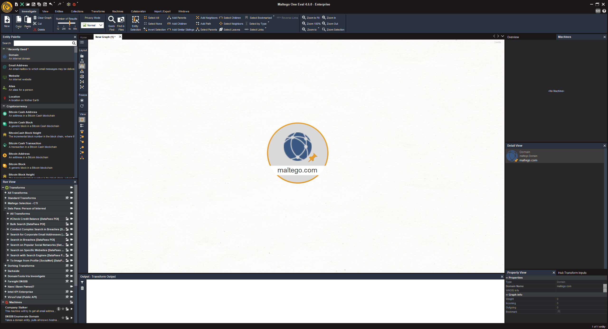
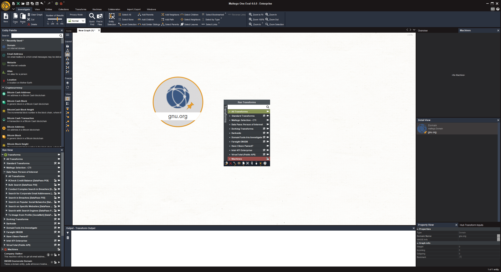
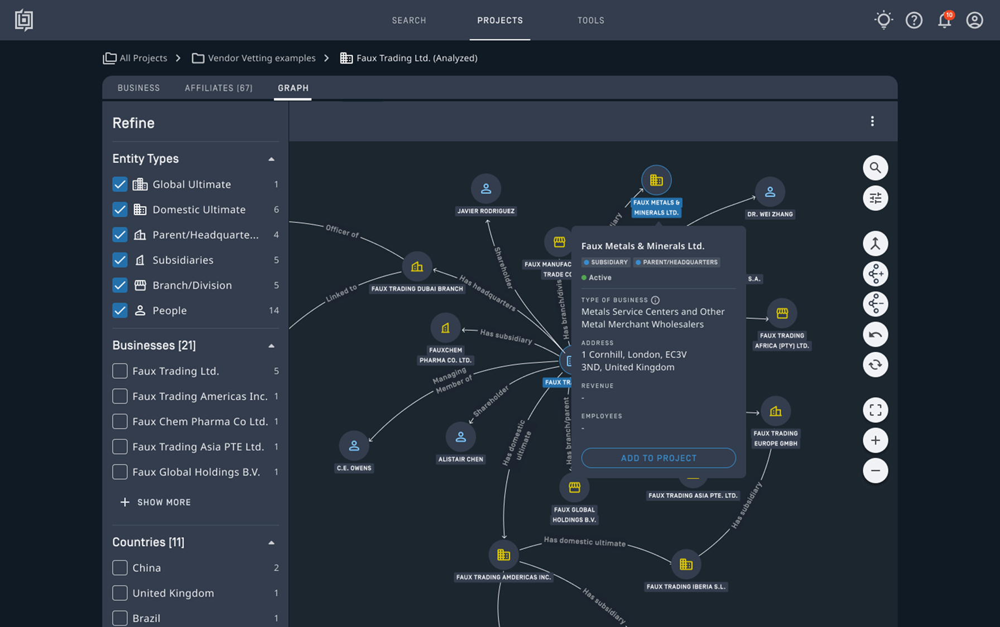

# Herramientas OSINT para personas y organizaciones

Una herramienta puede localizar contenido, relacionar datos, conservar evidencias o vigilar cambios. Son funciones diferentes. Antes de elegirla hay que decidir qué pregunta se quiere responder y qué clase de resultado hace falta.

Este apartado presenta herramientas que existen y explica cómo valorar su utilidad. Para la primera lectura bastan las explicaciones y las capturas. La elección se trabaja en [Operación Prisma · Elección de herramientas](casos/operacion-prisma/02-eleccion-de-herramientas.md); su uso aparece después, en [Obtención con herramientas](casos/operacion-prisma/03-obtencion-con-herramientas.md).

## Google: operadores y búsquedas combinadas

Los operadores son instrucciones que se escriben en la consulta para acotar resultados. No son etiquetas que haya que añadir al perfil investigado. La [ayuda de Google](https://support.google.com/websearch/answer/2466433?hl=es) explica los operadores principales; su [formulario de búsqueda avanzada](https://www.google.com/advanced_search) permite combinar condiciones sin memorizar la sintaxis.

### Sintaxis de referencia

| Operador o filtro | Función | Ejemplo sobre una fuente pública |
|---|---|---|
| `"frase exacta"` | Buscar una expresión concreta | `"Instituto Nacional de Ciberseguridad"` |
| `site:dominio` | Acotar a páginas indexadas de un sitio | `site:incibe.es "aviso legal"` |
| `-palabra` o `-"frase"` | Excluir términos | `"INCIBE" -"oferta de empleo"` |
| `filetype:pdf` | Seleccionar un formato | `site:incibe.es filetype:pdf "memoria"` |
| `after:AAAA-MM-DD` | Acotar por la fecha que Google atribuye al documento | `site:incibe.es "memoria" after:2024-01-01` |
| `before:AAAA-MM-DD` | Limitar a fechas anteriores | `site:incibe.es "memoria" before:2025-01-01` |
| `OR` | Buscar alternativas; se escribe en mayúsculas | `site:incibe.es "memoria" OR "informe anual"` |
| `intitle:palabra` | Acotar por un término en el título | `site:incibe.es intitle:memoria` |
| `inurl:palabra` | Acotar por un término en la dirección | `site:incibe.es inurl:aviso` |

No se deja un espacio entre operador y valor: `site:incibe.es`, no `site: incibe.es`. Las comillas delimitan la frase y el signo menos va unido al término excluido. Se pueden combinar filtros, pero conviene introducirlos de uno en uno para saber cuál cambia el resultado.

Google documenta `OR` en la búsqueda avanzada. La sintaxis de título y URL aparece también en su [documentación histórica de consultas](https://www.google.com/support/enterprise/static/gsa/docs/admin/current/gsa_doc_set/xml_reference/request_format.html). Su comportamiento puede variar en la búsqueda web; el formulario actual permite seleccionar dónde aparecen los términos. No se utilizan guías antiguas como garantía de que cualquier operador siga funcionando.

### De una pregunta a una consulta

| Paso | Consulta | Qué cambia |
|---|---|---|
| Localizar documentos de una organización | `site:incibe.es "memoria"` | Restringe sitio y expresión |
| Buscar una clase de documento | `site:incibe.es "memoria" filetype:pdf` | Añade formato |
| Acotar un periodo | `site:incibe.es "memoria" filetype:pdf after:2024-01-01 before:2025-01-01` | Añade fechas atribuidas por el buscador |
| Revisar si el filtro fue demasiado estricto | Retirar el formato o ampliar el periodo | Permite detectar exclusiones relevantes |

Una fecha filtrada no demuestra cuándo sucedió el hecho: hay que leer el documento. `site:` no produce un inventario completo de la web. El orden de resultados no mide credibilidad y el fragmento mostrado puede estar recortado o desactualizado.

Para una relación profesional se combinan nombre y organización, por ejemplo `"Marta Vega" "Náyade"`, y se comprueba cada candidato por separado. Este ejemplo es ficticio y sirve para preparar consultas; la obtención usa el objetivo público definido en el caso.

**Vínculo con Prisma:** preparar dos consultas distintas en [Pregunta y búsqueda](casos/operacion-prisma/01-pregunta-y-busqueda.md), justificar los operadores y registrar su uso en [Buscar y comparar versiones](casos/operacion-prisma/03-obtencion-con-herramientas.md#buscar-y-comparar-versiones).

## Intelligence X: localizar referencias en un índice y archivo

[Intelligence X, intelx.io](https://intelx.io/) es un buscador y archivo de datos. Su [ayuda oficial](https://help.intelx.io/) explica el tipo de servicio. Es diferente de Google: busca en su propio conjunto de datos y acepta entradas específicas, llamadas **selectores**.

### Entradas y resultados

| Entrada | Qué puede localizar | Qué debe revisarse |
|---|---|---|
| Dominio | Referencias al dominio, subdominios, direcciones web y correos asociados | Por qué aparece y de dónde procede el documento |
| URL con ruta | Coincidencias de esa dirección según las reglas del servicio | Normalización y alcance de la consulta |
| Correo corporativo autorizado | Apariciones de ese identificador | Contexto, fecha y necesidad de conservarlo |
| IP | Referencias a la dirección | Periodo y posible uso por varios clientes |

La [referencia de selectores](https://help.intelx.io/get-started/selector/) detalla estas diferencias. Una consulta de dominio y una de URL no tienen la misma amplitud; añadir un asterisco no equivale a ampliar libremente la búsqueda.

### Cómo interpretar una consulta

1. Define qué referencia necesitas encontrar y el identificador autorizado.
2. Elige el selector más acotado que responda a la pregunta.
3. Revisa los filtros disponibles de fecha y fuente; registra los utilizados.
4. Examina un resultado pertinente: procedencia, identificador del documento, contexto y fechas disponibles.
5. Contrasta la referencia con una fuente conocida. Registra si el contenido no puede consultarse por las condiciones de acceso.

Un dominio mencionado en un documento no prueba que la organización lo publicase. Una aparición en datos filtrados tampoco demuestra que una contraseña siga siendo válida ni autoriza a probarla. El material puede contener datos personales o secretos: para este tema se utilizan referencias públicas pertinentes y no se descargan colecciones de credenciales.

**Cuándo encaja:** buscar una referencia histórica difícil de localizar con un buscador general. **Cuándo no basta:** autenticar una instrucción de pago o atribuir una cuenta a una persona. **Acceso:** cobertura y contenido visible dependen de la cuenta.

**Vínculo con Prisma:** comparar Intelligence X con Google y Wayback para localizar una referencia de un canal. Si el expediente ya responde, no hace falta nueva obtención. La propuesta se anota en [Elección de herramientas](casos/operacion-prisma/02-eleccion-de-herramientas.md) y su ejecución en [Obtención](casos/operacion-prisma/03-obtencion-con-herramientas.md#intelligence-x-referencias-documentales).

## OpenCorporates: distinguir sociedades con nombres parecidos

[OpenCorporates](https://opencorporates.com/) reúne información de entidades legales procedente de registros. Su utilidad es localizar candidatos y comparar identificadores; la fuente registral de cada dato sigue siendo necesaria para interpretarlo.

| Campo que interesa | Por qué se conserva |
|---|---|
| Denominación | Permite comparar el nombre buscado y sus variantes |
| Jurisdicción | Distingue registros de países o territorios diferentes |
| Número de registro | Ayuda a identificar una sociedad de forma más precisa que su nombre |
| Estado y fechas disponibles | Sitúan temporalmente el dato |
| Procedencia | Permite remontarse al registro de origen |

Para buscar, introduce la denominación, acota jurisdicción y abre las fichas candidatas. Compara número de registro y fuente antes de unir resultados. Si el portal exige acceso para una función, consulta la información pública del registro correspondiente; no trates la restricción como inexistencia de la sociedad.

En Prisma sirve para plantear qué dato societario haría falta contrastar con PRI-F03. No se busca la empresa ficticia. El ejemplo real de [suplantación de proveedor](README.md#ejemplos-reales-nombre-sociedad-y-canal) muestra por qué la denominación aislada puede resultar engañosa. Encontrar una sociedad no autentica su web ni sus mensajes.

## OpenSanctions: contrastar coincidencias y listas de origen

[OpenSanctions](https://www.opensanctions.org/docs/) integra conjuntos de datos sobre sanciones y otras categorías, incluidas personas políticamente expuestas. Las categorías tienen significados distintos: aparecer como persona políticamente expuesta no equivale a estar sancionada ni a haber cometido un delito.

Una búsqueda devuelve candidatos. La documentación separa [estructura de entidades](https://www.opensanctions.org/docs/) y mecanismos de comparación. El parecido entre nombres requiere contraste, no una acusación.

| Comprobación | Motivo |
|---|---|
| Nombre y alias | Pueden existir variantes y homónimos |
| Identificadores y jurisdicción | Permiten separar candidatos |
| Conjunto y categoría | Indican por qué aparece la entidad |
| Fuente de origen y fecha | Permiten verificar el dato en su contexto |

El procedimiento es buscar el nombre autorizado, abrir el candidato, revisar categoría y procedencia y comprobar si los identificadores concuerdan. Se conserva el mínimo dato relevante. Las condiciones de uso y acceso se consultan en la documentación del servicio.

Para Prisma solo tendría sentido si el requerimiento incluyese una comprobación específica de esta clase. El encargo de cambio de canal no la exige. En [Elección de herramientas](casos/operacion-prisma/02-eleccion-de-herramientas.md) también se aprende a descartar una herramienta porque no responde a la pregunta.

## Maltego: relacionar entidades y fuentes

### Qué es y qué permite hacer

Maltego representa información mediante un grafo. Una **entidad** es un objeto, como un dominio, una organización o un perfil. Un enlace expresa una relación entre dos objetos. Las **transformaciones**, llamadas *Transforms* en la interfaz, toman una entidad y consultan una fuente o realizan una operación para devolver otras entidades. La [introducción del fabricante](https://www.maltego.com/blog/beginners-guide-to-maltego-charting-my-first-maltego-graph/) muestra este modelo.

También se pueden introducir datos ya obtenidos. Esto importa en Prisma: organizar PRI-F01, PRI-P01 y PRI-P03 no exige buscar los nombres ficticios en Internet. El grafo ayuda a ver qué relación está documentada y cuál solo ha sido declarada.

### Cómo leer la interfaz

Fuente: Maltego, [*Charting My First Maltego Graph*](https://www.maltego.com/blog/beginners-guide-to-maltego-charting-my-first-maltego-graph/), 12 de marzo de 2024. Captura del ejemplo del fabricante, ajeno a Operación Prisma.

Observa tres zonas: la paleta de entidades a la izquierda, el área del grafo en el centro y los detalles de la entidad seleccionada a la derecha. El tipo de entidad y su valor deben coincidir: un nombre de empresa no se introduce como si fuera un dominio.

Fuente: Maltego, [mismo tutorial](https://www.maltego.com/blog/beginners-guide-to-maltego-charting-my-first-maltego-graph/). El menú corresponde a la versión mostrada en la publicación; las opciones disponibles dependen de la edición y las integraciones.

El menú ofrece proveedores y transformaciones. No significa que todas sean apropiadas ni estén incluidas en la cuenta. Antes de ejecutarlas se comprueban entrada, fuente consultada, datos enviados y tipo de salida esperado. La [documentación de Maltego](https://docs.maltego.com/en/support/home) distingue sus componentes e integraciones.

### Cuándo encaja y qué límites tiene

| Necesidad | Utilidad de Maltego | Precaución |
|---|---|---|
| Comparar proveedor, dominios y perfiles | Reunir relaciones en un mapa | Etiquetar enlaces por fuente y fecha |
| Ver si varias publicaciones dependen de una sola | Representar cadenas de procedencia | No convertir una flecha en confirmación independiente |
| Ampliar una pista con una fuente autorizada | Ejecutar una transformación concreta | Revisar qué consulta realmente y qué transmite |
| Preparar una valoración | Mostrar evidencias y candidatos separados | Un grafo vistoso no demuestra identidad ni autoría |

En Prisma se pueden representar estas relaciones: «la página enlaza al perfil», «el perfil declara un puesto» y «el anuncio propone un canal». Las tres tienen distinto valor probatorio. Unirlas sin etiquetar borraría esa diferencia.

**Antes de usarla:** determina si necesitas obtener datos nuevos o solo ordenar los que ya tienes. **Vínculo con el caso:** [elección](casos/operacion-prisma/02-eleccion-de-herramientas.md) y [construcción del grafo](casos/operacion-prisma/03-obtencion-con-herramientas.md#maltego-construir-y-revisar-relaciones).

## Babel X y Babel Street Insights: buscar y seguir información multilingüe

### Qué es

**Babel X** es el nombre anterior de Babel Street Insights, como explica el fabricante en su [repaso de cambios del producto](https://www.babelstreet.com/blog/putting-ai-to-work-how-babel-street-is-revolutionizing-identity-intelligence-and-risk-operations). Esta familia de herramientas se orienta a búsqueda multilingüe, análisis de texto y seguimiento de publicaciones. Permite plantear búsquedas y filtros sobre distintas fuentes y lenguas.

La oferta actual del fabricante se presenta como [Babel Street Insights y su plataforma](https://www.babelstreet.com/platform). La denominación anterior ayuda a reconocer referencias antiguas; interfaz, licencia y cobertura se comprueban en la documentación del producto disponible.

### Qué problema resuelve

Una consulta manual puede bastar para verificar un aviso. Una plataforma de este tipo resulta más interesante cuando hay muchas menciones, varios idiomas o necesidad de repetir la búsqueda y revisar cambios. Ayuda a localizar y agrupar material; cada resultado debe volver a su fuente para comprobar contexto y vigencia.

Fuente: Babel Street, [*Transformative Business Search Delivers Profiles and Relationships*](https://www.babelstreet.com/blog/transformative-business-search). La imagen muestra Business Search de Insights, **no una captura de Babel X de 2020**. Ejemplo de empresas del fabricante, ajeno al caso.

En esta vista se distinguen filtros, entidades y enlaces entre organizaciones. Lee el tipo de relación antes de interpretarla: filial, participación o vinculación declarada no son relaciones equivalentes. La [presentación de Business Search](https://www.babelstreet.com/blog/transformative-business-search) describe esta función.

### Cómo valorar su uso en una investigación

Para Prisma, una petición de tres publicaciones en una sola lengua no justifica por sí misma contratar una plataforma. Si el aviso circulase en varios países y se necesitase seguimiento continuado, habría que comparar cobertura, consultas, acceso y exportación con una búsqueda manual.

El plan de consulta debe incluir nombres o variantes necesarios, periodo, lenguas relevantes, tipos de fuente y criterios para excluir homónimos. Una coincidencia de texto o una traducción automática no verifica una identidad. Tampoco se debe asumir que todo dato disponible dentro de una plataforma procede de fuentes abiertas: la [oferta actual](https://www.babelstreet.com/insights-investigator-agentic-ai-risk-intelligence) combina tipos de datos y capacidades que deben revisarse según el acceso contratado.

**Acceso:** plataforma comercial; no se exige contratarla. Si existe acceso institucional, se utiliza para una consulta acotada. Si no existe, se explica la elección y se ejecuta una alternativa accesible, dejando constancia del cambio. **Vínculo con el caso:** [comparación de opciones](casos/operacion-prisma/02-eleccion-de-herramientas.md) y [consulta posterior](casos/operacion-prisma/03-obtencion-con-herramientas.md#babel-street-consulta-y-alternativa).

## Hunchly: conservar el recorrido y las evidencias web

Hunchly ayuda a conservar páginas durante la investigación y a relacionarlas con un expediente. Su función principal es la trazabilidad: dirección, tiempo de captura, contenido y referencias. La [presentación oficial](https://hunch.ly/) describe la conservación y organización del material obtenido.

| Lo que aporta | Lo que no sustituye |
|---|---|
| Registro de páginas consultadas | El requerimiento y sus exclusiones |
| Capturas y organización por caso | La evaluación de la información |
| Referencias para volver al contenido | La comprobación de que la afirmación es verdadera |

En Prisma sería útil si el anuncio pudiera desaparecer y hubiera que conservar su estado. Antes de capturar se revisan el espacio de trabajo, la cuenta y el tipo de datos que quedará almacenado. Capturar automáticamente todo lo visitado puede incluir material ajeno al encargo.

La [documentación del formato MHTML](https://docs.maltego.com/en/support/solutions/articles/15000061288-the-mhtml-file-format) explica uno de los mecanismos de conservación. Una captura conserva una representación de la página; no garantiza que haya recogido todo contenido dinámico ni constituye, por sí sola, verificación del hecho.

**Vínculo con el caso:** elegir entre conservación y obtención en el [apartado 2](casos/operacion-prisma/02-eleccion-de-herramientas.md); registrar evidencias en el [apartado 3](casos/operacion-prisma/03-obtencion-con-herramientas.md#conservar-el-resultado).

## Google Lens y TinEye: contrastar imágenes

Las búsquedas inversas permiten localizar coincidencias y usos anteriores de una imagen. [Google Lens](https://support.google.com/websearch/answer/1325808?hl=es) permite consultar una imagen o una región seleccionada. [TinEye](https://tineye.com/how) se centra en coincidencias de imágenes en su índice.

Encajan cuando se pregunta si una imagen se ha reutilizado, no cuando se pretende acreditar una identidad solo por un rostro. Hay que abrir la fuente del resultado y comprobar fecha y contexto. Una coincidencia visual aproximada no es una copia confirmada; no encontrar coincidencias no demuestra originalidad.

En Prisma, IMG-01 se presenta como imagen de una reunión reciente. La pregunta es si existe un uso anterior. El expediente ya aporta esa relación para el análisis sin Internet. Más adelante se practica el procedimiento con una imagen pública indicada, sin subir documentos privados.

**Vínculo con el caso:** [elección de herramienta](casos/operacion-prisma/02-eleccion-de-herramientas.md) y [verificación de publicaciones](casos/operacion-prisma/05-publicaciones-y-contexto.md).

## Wayback Machine: consultar versiones anteriores

[Wayback Machine](https://web.archive.org/) permite consultar capturas archivadas de páginas. Sirve para comparar el contenido disponible en dos momentos: un canal de contacto, un aviso, una descripción de servicios o enlaces corporativos. La [guía del Internet Archive](https://help.archive.org/help/using-the-wayback-machine/) explica la selección de versiones.

El resultado se registra con la URL archivada y la fecha de captura. Esa fecha no necesariamente coincide con la publicación del contenido. Un archivo incompleto o una página sin capturas dejan una laguna, no prueban inexistencia.

En Prisma ayuda a formular la comprobación de un cambio de canal. Primero se decide qué versión sería necesaria; después se consulta una página pública real para practicar el procedimiento.

**Vínculo con el caso:** [obtención](casos/operacion-prisma/03-obtencion-con-herramientas.md#buscar-y-comparar-versiones) y [valoración final](casos/operacion-prisma/06-organizacion-y-valoracion.md).

## Buscadores, BORME y OSINT Framework: localizar fuentes concretas

Un buscador permite acotar por frase, dominio y formato. El [BORME](https://www.boe.es/diario_borme/) es una fuente para actos societarios publicados, no una herramienta que autentique mensajes. [OSINT Framework](https://osintframework.com/) es un directorio de recursos: ayuda a localizar opciones, pero no ejecuta ni valida las consultas.

| Necesidad | Elección razonable | Comprobación |
|---|---|---|
| Aviso en un dominio conocido | Buscador y página original | URL, fecha y origen |
| Acto societario | BORME | Denominación, fecha y tipo de acto |
| Encontrar una herramienta para una pregunta nueva | OSINT Framework | Fuente, requisitos y adecuación al alcance |

Para un expediente pequeño estas opciones pueden resultar más proporcionadas que una plataforma amplia. La elección se justifica por la pregunta y los recursos disponibles.

## Comparar antes de elegir

| Pregunta | Familia de herramienta | Ejemplo |
|---|---|---|
| ¿Dónde aparece esta información? | Búsqueda | Buscador, Babel Street |
| ¿Hay una referencia en un archivo especializado? | Índice documental | Intelligence X |
| ¿Qué sociedad concreta se menciona? | Datos societarios | OpenCorporates, BORME |
| ¿Una coincidencia corresponde a una lista relevante? | Contraste de entidades | OpenSanctions y fuente de origen |
| ¿Qué relaciones están documentadas? | Análisis de enlaces | Maltego |
| ¿Qué versión existía antes? | Archivo web | Wayback Machine |
| ¿La imagen circulaba en otro contexto? | Búsqueda inversa | Lens, TinEye |
| ¿Cómo conservo lo observado? | Captura de evidencias | Hunchly |

La [procedencia de las imágenes](../../imagenes/03-04-capturas.md) permite comprobar sus fuentes. Los objetivos que aparecen en las capturas ilustran la interfaz; no forman parte del alcance de las prácticas.
