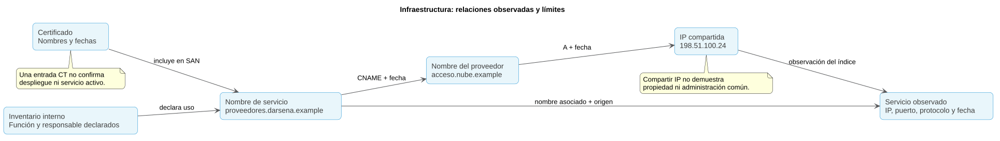
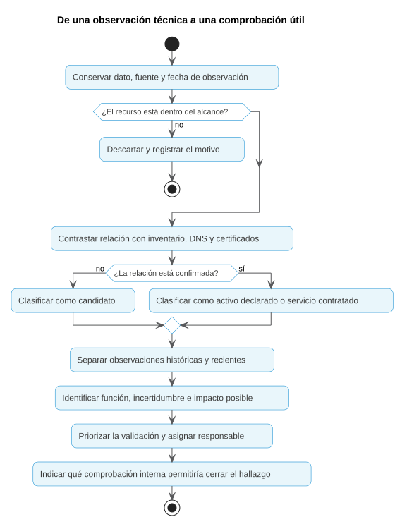

# OSINT técnico: infraestructura y superficie de exposición

## Una primera aproximación

Una empresa conoce su web y su correo, pero en fuentes públicas también aparecen un portal antiguo, un nombre de pruebas y un servicio que nadie recuerda haber publicado. ¿Son activos actuales? ¿Los administra la empresa o un proveedor? ¿Cuál merece revisarse primero?

El OSINT técnico ayuda a reconstruir qué infraestructura se observa desde fuera y qué relaciones pueden sostenerse con evidencia. Cada dato tiene un momento y una fuente: una IP, un certificado o un registro de un buscador no describen por sí solos el estado actual del sistema.

| Observación | Pregunta que abre | Decisión posible |
|---|---|---|
| Un nombre aparece en un certificado público | ¿Se llegó a utilizar y quién lo administra? | Pedir al responsable que revise su inventario |
| Un dominio resuelve a una IP compartida | ¿Hay relación con un servicio concreto? | Mantener separado el proveedor del activo de la empresa |
| Un índice conserva una página de acceso antigua | ¿Sigue publicada y es necesaria? | Priorizar una comprobación interna autorizada |
| Una respuesta anuncia un producto | ¿El dato corresponde al servidor, a un intermediario o a una plantilla? | Verificar la tecnología antes de valorar vulnerabilidades |

Trabajaremos con [**Operación Delta**](casos/operacion-delta/README.md), una revisión ficticia de la exposición de Dársena Logística. Primero se interpreta el expediente y se eligen herramientas. Después se practica la obtención sobre un objetivo público autorizado, manteniendo separadas sus evidencias.

## Mirar la exposición desde el lado del atacante

Un atacante busca puntos que le permitan reducir esfuerzo: servicios olvidados, funciones sensibles publicadas, nombres que revelen un uso o tecnologías que orienten su investigación. El analista defensivo se hace esas mismas preguntas para verificar exposición y proponer controles.

| Pista pública | Interés posible para un atacante | Pregunta defensiva |
|---|---|---|
| Nombre de acceso remoto | Localizar una función de administración | ¿Es necesario, quién lo gestiona y con qué controles? |
| Portal de legado | Encontrar un activo que pudo quedar fuera del mantenimiento | ¿Se retiró realmente y hay evidencia de cierre? |
| Certificado con un nombre de pruebas | Detectar un candidato no inventariado | ¿Se utilizó y quién lo conoce? |
| Banner de producto | Orientar la búsqueda de debilidades | ¿La señal refleja la tecnología y versión actuales? |

El uso ético conserva autorización, alcance y trazabilidad. El uso malicioso busca aprovechar o perjudicar. Observar una pista para prevenir un riesgo no exige probar accesos ni explotar el servicio. Se mantiene la distinción entre dato, inferencia y acción propuesta.

**Caso:** abre [Delta · Perspectiva del atacante](casos/operacion-delta/00-perspectiva-del-atacante.md). Trabaja solo con las observaciones facilitadas.

## Superficie de ataque externa: concepto y alcance

### Activo, exposición y vulnerabilidad

La **superficie de ataque externa** reúne los puntos accesibles desde fuera que podrían utilizarse para atacar una organización: webs, portales, acceso remoto, correo, API y otros servicios. La revisión de la **superficie de exposición** identifica qué se publica o puede observarse y si encaja con el uso previsto.

| Concepto | Significado | Ejemplo |
|---|---|---|
| Activo | Recurso que la organización utiliza o debe gestionar | Portal de proveedores |
| Exposición | Accesibilidad o información visible desde fuera | El portal aparece en un índice de servicios |
| Vulnerabilidad | Debilidad que puede comprometer la seguridad | Un fallo confirmado en la configuración del portal |
| Riesgo | Posible daño teniendo en cuenta uso, amenaza y controles | Acceso indebido a documentos de proveedores |

Un servicio público puede ser necesario y estar bien protegido. También puede existir una exposición innecesaria sin una vulnerabilidad confirmada. **Encontrar un puerto o una página de acceso no demuestra una intrusión.**

### Definir las fronteras

| Dentro de Operación Delta | Fuera del alcance |
|---|---|
| Nombres bajo `darsena.example` y muestras incluidas | Otros clientes del proveedor de alojamiento |
| Relación entre inventario y observaciones públicas | Escaneos, fuerza bruta o pruebas de explotación |
| Clasificación de activos y datos históricos | Iniciar sesión o probar credenciales |
| Petición de validación al responsable interno | Solicitar un nuevo escaneo desde una plataforma externa |

Usar un servicio de nube no implica controlar sus IP ni autoriza a revisar otros sistemas del proveedor. El alcance debe distinguir **propiedad**, **uso** y **administración**.

### Obtener datos sin confundir los métodos

| Método | Ejemplo | Qué contacto produce |
|---|---|---|
| Analizar muestras entregadas | Leer el CSV del caso | Ninguno con el objetivo |
| Consultar datos ya recogidos por terceros | Índice de servicios, DNS pasivo o registros de certificados | Consulta al tercero; el dato puede ser antiguo |
| Consultar DNS mediante un resolvedor | Resolver un registro A | Puede generar consultas hacia servidores autoritativos |
| Abrir una web o negociar TLS | Solicitar la página o su certificado | Conexión con el servicio o su intermediario |
| Escanear o solicitar un escaneo nuevo | Comprobar puertos de un servidor | Interacción activa con el objetivo |

Que una herramienta esté disponible no cambia el alcance. La documentación de un índice puede describir cómo escanea; consultar sus datos existentes y pedirle que escanee ahora son acciones distintas.



El primer apartado del caso, [Alcance e inventario](casos/operacion-delta/01-alcance-e-inventario.md), separa activos conocidos, candidatos y servicios de terceros.

## Footprinting técnico: construir el mapa externo

El **footprinting técnico** reconoce nombres, direcciones, proveedores y servicios que pueden relacionarse con una organización desde fuentes permitidas. Continúa la huella corporativa del Tema 3: parte de dominios conocidos y construye relaciones documentadas, sin asumir que todo resultado pertenece al objetivo.

| Paso | Dato que se registra | Pregunta |
|---|---|---|
| Referencia inicial | Dominio y fuente que lo relaciona con la organización | ¿Por qué entra en el alcance? |
| Nombres y registro | RDAP, DNS y fechas | ¿Qué se declaró o respondió? |
| Certificados | Nombres, emisor, validez y entrada CT | ¿Qué relación está documentada? |
| Servicios | IP, puerto, protocolo y fecha del índice | ¿Qué observó la fuente? |
| Contraste | Inventario, función y responsable | ¿Es un activo propio, un servicio contratado o un candidato? |

Una ampliación desde dominio a IP y desde IP a otros dominios puede incorporar terceros. Cada salto necesita fuente, fecha y justificación. El resultado es un mapa acotado; no una lista de todo lo que comparte alojamiento. Aplica esta distinción en [Alcance e inventario](casos/operacion-delta/01-alcance-e-inventario.md).

## Herramientas disponibles y criterios de elección

Maltego representa relaciones; SpiderFoot y Amass permiten plantear obtenciones más amplias; Shodan y Censys consultan servicios ya indexados. RDAP, DNS y CT responden a preguntas concretas. La herramienta adecuada depende de qué dato falta, no de cuántas funciones ofrezca.

Consulta [Herramientas OSINT para infraestructura](herramientas.md), con explicaciones, ejemplos y capturas referenciadas. Antes de elegir hay que conocer fuente, salida, fecha, acceso y posible contacto con el objetivo.

**Caso:** completa [Delta · Elección de herramientas](casos/operacion-delta/02-eleccion-de-herramientas.md), sin ejecutar consultas. Después interpreta los registros aportados en el apartado siguiente: la elección puede revisarse al comprender mejor los datos.

## WHOIS, DNS y certificados

Son fuentes complementarias. Los datos de registro describen un dominio o recurso; DNS relaciona nombres y destinos; un certificado relaciona una clave con nombres u otras identidades bajo unas condiciones concretas. Ninguna de esas fuentes identifica por sí sola al autor de una actividad.

### WHOIS y RDAP: datos de registro

WHOIS es el mecanismo tradicional para consultar datos de registro. **RDAP** (*Registration Data Access Protocol*) ofrece consultas y respuestas estructuradas y es su sustituto en el entorno de registro de dominios. Para dominios genéricos, la referencia actual es RDAP; la disponibilidad de WHOIS y los datos publicados dependen del registro y de sus políticas. La [explicación de ICANN](https://www.icann.org/rdap) permite distinguir ambos mecanismos.

| Campo | Qué indica | Qué no permite concluir |
|---|---|---|
| Registrador | Entidad que presta el servicio de registro | Que sea quien utiliza el dominio |
| Fecha de creación | Alta del registro actual del dominio | Inicio de la actividad de la empresa |
| Fecha de actualización | Cambio en el registro | Cambio de propietario sin conocer qué se modificó |
| Fecha de expiración | Fecha prevista en el registro | Que el dominio vaya a dejar de funcionar ese día |
| Servidores de nombres | Infraestructura delegada para DNS | Propiedad del contenido web |
| Titular publicado, oculto o redactado | Información disponible según la política aplicable | Que ocultar datos indique una actividad maliciosa |

El registro de una IP o un rango suele señalar al proveedor que recibió la asignación, no al cliente que utiliza un servicio. Registrar el contacto técnico tampoco demuestra autoría.

### DNS: nombres, registros y tiempo

**DNS** (*Domain Name System*) permite consultar registros asociados a nombres. Un dominio puede tener varios destinos y cambiar con el tiempo. Para interpretar una respuesta hay que conservar nombre, tipo, valor, fuente y fecha.

| Tipo | Qué contiene | Utilidad en el análisis |
|---|---|---|
| A | Dirección IPv4 | Relacionar un nombre con un destino observado |
| AAAA | Dirección IPv6 | Evitar que el mapa se limite a IPv4 |
| CNAME | Otro nombre del que este es alias | Reconocer delegación a un servicio o intermediario |
| MX | Servidores de correo y prioridad | Identificar el servicio de correo declarado |
| NS | Servidores de nombres de una zona | Observar quién presta DNS |
| TXT | Texto con distintos usos | Leer declaraciones como SPF o verificaciones de servicios |
| PTR | Nombre asociado a una dirección en DNS inverso | Obtener una pista; no probar titularidad |

Los tipos básicos se describen en [RFC 1035](https://www.rfc-editor.org/rfc/rfc1035); AAAA se incorpora en [RFC 3596](https://www.rfc-editor.org/rfc/rfc3596). La [RFC 1034](https://www.rfc-editor.org/rfc/rfc1034) explica resolución y caché.

El **TTL** indica cuánto tiempo puede conservarse un registro en caché. No dice cuánto tiempo lleva activo ni garantiza que la información no haya cambiado. **DNS pasivo** es un histórico de respuestas observadas por una fuente: «primera vez vista» significa primera observación en ese conjunto, no fecha de creación del nombre.

**Ejemplo real: caída de Facebook, 4 de octubre de 2021.** Su informe técnico explicó que una interrupción de la red troncal provocó la retirada de anuncios BGP —las rutas que permiten llegar a una red— y volvió inaccesibles sus servidores DNS, aunque estos seguían funcionando. Una observación externa de fallo DNS no revelaba por sí sola toda la causa interna. [Informe del equipo de ingeniería, 5 de octubre de 2021](https://engineering.fb.com/2021/10/05/networking-traffic/outage-details/).

Aplicación: si una consulta no obtiene respuesta, registra hora, tipo de fallo y fuente. No lo conviertas en «el dominio nunca existió» ni «el servicio fue retirado». En Delta se separan las observaciones históricas de las lagunas actuales.

Ejemplo del expediente:

```text
2026-09-21T07:50:00Z  proveedores.darsena.example  CNAME  acceso.nube.example
2026-09-21T07:50:00Z  acceso.nube.example         A      198.51.100.24
```

La secuencia relaciona el portal con un servicio del proveedor en esa fecha. No permite incorporar todos los nombres que resuelven a `198.51.100.24` al inventario de Dársena: puede ser alojamiento compartido o un intermediario.

Para una demostración sobre un nombre expresamente autorizado, PowerShell permite consultar DNS con [`Resolve-DnsName`](https://learn.microsoft.com/en-us/powershell/module/dnsclient/resolve-dnsname):

```powershell

# Sustituir únicamente por un nombre autorizado para la demostración.

# El dominio ficticio del caso no proporciona las respuestas del expediente.
Resolve-DnsName -Name proveedores.darsena.example -Type CNAME -DnsOnly
Resolve-DnsName -Name darsena.example -Type MX -DnsOnly
```

Estas son consultas de red, no una lectura de DNS pasivo. En Operación Delta se usa [dns.csv](casos/operacion-delta/datos/dns.csv).

### Certificados y registros públicos

Un certificado TLS contiene una clave pública, emisor, fechas de validez y nombres, entre otros campos. **TLS** protege conexiones; ver un certificado no demuestra que el sitio sea honesto ni que el sistema esté libre de fallos.

| Campo | Lectura útil | Límite |
|---|---|---|
| SAN (*Subject Alternative Name*) | Nombres incluidos en el certificado | No garantiza que todos estén publicados como servicios |
| Emisor | Autoridad que emitió el certificado | Un emisor común no relaciona administradores |
| Inicio y fin de validez | Intervalo declarado en el certificado | No acredita despliegue ni disponibilidad durante todo el intervalo |
| Huella del certificado | Identificador para comparar el mismo certificado | No identifica una persona |
| Nombre comodín, como `*.darsena.example` | Cobertura para nombres de un nivel bajo el dominio | No enumera los subdominios existentes |

La [RFC 5280](https://www.rfc-editor.org/rfc/rfc5280) describe el formato y sus extensiones. Un certificado con varios nombres puede ser una pista de gestión conjunta; hay que valorar si corresponde a un servicio compartido.

**Certificate Transparency (CT)** registra públicamente certificados o precertificados. Los registros permiten detectar nombres que quizá no figuran en el inventario y consultar antecedentes sin conectar con esos nombres. Encontrar una entrada no prueba que el certificado llegara a desplegarse ni que el servicio siga funcionando. La [RFC 9162](https://www.rfc-editor.org/rfc/rfc9162) describe el modelo de registros; las herramientas pueden consultar datos de distintas versiones del protocolo.

En un buscador como crt.sh se puede plantear una búsqueda por dominio. La [respuesta de ejemplo para www.example.org](https://crt.sh/?q=www.example.org&output=json) muestra entradas en JSON. `%.darsena.example` ilustra una búsqueda de nombres bajo el dominio; al ser ficticio no se esperan resultados reales. Se revisan nombres y fechas, se agrupan duplicados y se conserva la referencia de cada entrada relevante.

### Ejemplo real: DigiNotar y un certificado fraudulento

El 29 de agosto de 2011 Google informó de intentos de interceptar conexiones de sus usuarios utilizando un certificado fraudulento emitido por DigiNotar. El certificado se utilizaba para hacer pasar un destino por un servicio legítimo; Google anunció medidas para retirar la confianza en la entidad emisora. [Comunicado original de Google](https://security.googleblog.com/2011/08/update-on-attempted-man-in-middle.html).

Este incidente es anterior al despliegue actual de CT; no se presenta como una detección realizada con crt.sh. Ilustra un límite: que un certificado contenga un nombre no prueba por sí solo legitimidad ni quién administra un servicio. En una revisión se contrasta emisor, fechas, confianza y otras fuentes; para Delta se aplica al [análisis de certificados](casos/operacion-delta/03-registro-dns-y-certificados.md).

En [Registro, DNS y certificados](casos/operacion-delta/03-registro-dns-y-certificados.md) se comparan un nombre de pruebas, un portal actual y una referencia histórica.

## De la elección a la obtención

Se ejecuta una consulta porque responde a una pregunta y está dentro del alcance. El resultado se conserva con la herramienta, la referencia, la fecha de consulta y la fecha del dato. Si una plataforma necesita acceso que no está disponible, se documenta la alternativa; no se interpreta la restricción como ausencia del servicio.

**Caso:** continúa en [Delta · Obtención con herramientas](casos/operacion-delta/04-obtencion-con-herramientas.md). Usa el plan elegido y vuelve después a la explicación de índices y tecnologías para revisar las conclusiones.

## Motores de indexación de dispositivos expuestos

### Qué contienen Shodan y Censys

Estos servicios recogen observaciones de infraestructura accesible en Internet y permiten consultar los datos ya indexados. Una ficha puede incluir IP, puerto, protocolo, respuesta del servicio, certificado y momento de observación. Sus conjuntos de datos, cobertura y fechas pueden diferir.

Un **banner** es información que el servicio devuelve durante una interacción, como una cabecera HTTP o un saludo de protocolo. Es una observación, no una comprobación de todo el sistema. La [documentación de Shodan](https://help.shodan.io/the-basics/search-query-fundamentals) explica el banner y la sintaxis de filtros.

| Consulta de ejemplo en Shodan | Qué pretende acotar |
|---|---|
| `net:192.0.2.0/24` | Observaciones de un rango autorizado |
| `hostname:darsena.example` | Nombres asociados por el índice al dominio |
| `net:192.0.2.0/24 port:443` | Resultados del rango en ese puerto |

El rango del ejemplo está reservado para documentación. Estas consultas muestran el método; no producen el expediente ni autorizan una búsqueda fuera del alcance. Los filtros disponibles se consultan en la [referencia de Shodan](https://www.shodan.io/search/filters). Coincidir con un filtro de nombre tampoco confirma propiedad.

Censys Platform utiliza **CenQL**. Conviene consultar su [guía de inicio](https://docs.censys.com/docs/platform-quickstart-guide) y la [referencia del lenguaje](https://docs.censys.com/docs/censys-query-language), porque la sintaxis de Censys Legacy Search es distinta.

```text
host.ip: "192.0.2.0/24" and host.services.port=443
host.ip: "192.0.2.0/24" and host.services: (port=443 and protocol=HTTP)
```

La primera consulta busca hosts del rango con un servicio en 443. La segunda exige que puerto y protocolo coincidan **en el mismo servicio**. Sin agrupación, condiciones sobre varios campos pueden cumplirse en servicios diferentes del host. Después hay que leer la ficha y la fecha, no quedarse con el contador de resultados.

### Leer una observación

**Ejemplo real: DDoS contra GitHub, 28 de febrero de 2018.** GitHub documentó un ataque de denegación de servicio que utilizó amplificación mediante servidores memcached expuestos y alcanzó un pico de 1,35 Tbps. El informe distingue la afectación a disponibilidad de la confidencialidad e integridad de los datos. [Informe de GitHub, 1 de marzo de 2018](https://github.blog/engineering/infrastructure/ddos-incident-report/).

Cloudflare había explicado el 27 de febrero la exposición de memcached por UDP en el puerto 11211 y medidas para limitarla. [Análisis técnico de Cloudflare](https://blog.cloudflare.com/memcrashed-major-amplification-attacks-from-port-11211/).

| Qué enseña el incidente | Aplicación a la lectura de un índice |
|---|---|
| Un servicio publicado puede tener consecuencias para terceros | Revisar función, necesidad y controles |
| Puerto y transporte importan | No equiparar una observación TCP con una UDP |
| Exposición e incidente son hechos distintos | Un resultado del índice no demuestra que el servidor participase en el ataque |
| Las fuentes tienen fecha | No trasladar una cifra o configuración de 2018 al estado actual |

En Delta, DEL-S04 justifica una comprobación del servicio remoto y de su responsable; no prueba acceso no autorizado. Se interpreta en [Servicios indexados](casos/operacion-delta/05-servicios-indexados.md).

| Campo mínimo | Por qué se conserva |
|---|---|
| IP, puerto y transporte | Sitúa el punto observado, por ejemplo 443/TCP |
| Nombre y forma de asociación | Distingue DNS, certificado y nombre enviado en la petición |
| Protocolo y respuesta | Describe lo que realmente vio el observador |
| Fecha de observación | Permite valorar vigencia |
| Fecha de consulta | Indica cuándo obtuvimos el registro |
| Fuente y referencia | Permite reconstruir el hallazgo |

Un registro antiguo puede justificar una revisión, pero se redacta en pasado. Que un índice no encuentre el servicio no acredita su ausencia. Dos índices pueden corroborar una exposición en fechas distintas y aun así no demostrar el estado actual.

El apartado [Servicios indexados](casos/operacion-delta/05-servicios-indexados.md) compara una exposición antigua con un servicio observado más recientemente.

## Fingerprinting de tecnologías y servicios

### Qué significa identificar una tecnología

*Fingerprinting* consiste en inferir tecnologías a partir de señales observables. Una cabecera, una cookie, el título de una página, rutas de archivos o una respuesta de protocolo pueden orientar la identificación. Cada señal tiene límites.

| Señal | Hipótesis posible | Explicación alternativa |
|---|---|---|
| Cabecera `Server: nginx` | Hay un componente que se identifica como nginx | Puede ser un proxy y ocultar el servidor de la aplicación |
| Cookie con un nombre habitual de un entorno | La aplicación utiliza ese entorno | El nombre puede imitarse o quedar tras una migración |
| Título «Portal de proveedores» | La página presenta esa función | Puede ser una plantilla, una copia o un servicio antiguo |
| Puerto 22 | Podría ofrecer SSH | El puerto por sí solo no confirma el protocolo |
| Versión declarada en un banner | El servicio anuncia esa versión | Puede ser un dato alterado o no reflejar parches aplicados |

La [referencia de la cabecera Server de MDN](https://developer.mozilla.org/en-US/docs/Web/HTTP/Reference/Headers/Server) explica qué comunica ese campo. El análisis debe distinguir componente frontal, aplicación y sistema operativo.

### De la señal a una conclusión útil

1. Escribir la señal literal y su referencia.
2. Proponer qué tecnología podría explicarla.
3. Buscar otra señal que no sea una repetición de la misma detección.
4. Revisar si un intermediario o un dato histórico explican la observación.
5. Expresar la confianza y pedir validación interna si la decisión requiere certeza.

Ejemplo con una muestra del expediente:

```http
HTTP/1.1 200 OK
Server: nginx
Content-Type: text/html
Set-Cookie: PHPSESSID=muestra-docente; Secure; HttpOnly
```

Es compatible con un componente nginx y una aplicación que usa una cookie llamada `PHPSESSID`. No confirma la versión de nginx, la versión de PHP ni una vulnerabilidad. La muestra es ficticia y no contiene una sesión utilizable.

Las extensiones de detección también infieren a partir de señales y pueden enviar información al proveedor o visitar el objetivo. Primero se interpreta DEL-H01 como muestra. Más adelante se pueden comparar detecciones con señales de una web propia o expresamente autorizada, según la opción elegida en el caso.

### Priorizar sin exagerar



| Situación | Prioridad orientativa | Siguiente paso |
|---|---|---|
| Servicio de administración observado recientemente y sin responsable conocido | Alta para validación | Pedir al equipo interno que confirme necesidad y controles |
| Portal público previsto y con responsable | Revisión ordinaria | Comparar exposición con el uso aprobado |
| Nombre en CT sin otras observaciones | Pendiente de comprobar | Revisar inventario y antecedentes |
| Servicio antiguo que el inventario declara retirado | Verificación de cierre | Confirmar internamente que dejó de publicarse |
| IP de un proveedor compartida con otros clientes | No atribuir como activo propio | Delimitar el servicio contratado |

La prioridad combina relación con la organización, actualidad, función e impacto posible. No se asigna gravedad técnica solo porque el nombre contenga `admin` o porque aparezca una versión.

En [Tecnologías y prioridades](casos/operacion-delta/06-tecnologias-y-prioridades.md) se prepara una nota con hallazgo, evidencia, límite, responsable y próxima comprobación.

## Una vista completa

| Resultado del trabajo | Contenido mínimo |
|---|---|
| Inventario contrastado | Activo, función, relación, responsable y estado observado |
| Mapa de relaciones | Nombre, DNS, IP, certificado y servicio, con fuente y fecha |
| Hallazgos priorizados | Evidencia, posible impacto, limitación y comprobación pendiente |
| Bitácora | Consultas, resultados y decisiones, incluidos los descartes |

Antes de cerrar, comprueba:

- ¿Has distinguido un activo propio de un servicio de un proveedor?
- ¿Cada relación conserva su fuente y fecha de observación?
- ¿Has separado datos históricos del estado actual?
- ¿Has evitado presentar una exposición como vulnerabilidad o intrusión confirmada?
- ¿Cada prioridad termina en una comprobación que alguien puede realizar?

Las [plantillas de evaluación de fuentes](../../plantillas/plantilla-evaluacion-fuentes.md), [bitácora](../../plantillas/plantilla-bitacora-investigacion.md) e [informe](../../plantillas/plantilla-informe-inteligencia.md) permiten conservar este resultado. Las actividades evaluables y las instrucciones de entrega pertenecen al repositorio del curso.

## Continuación

El siguiente tema introduce las [fuentes cerradas y la dark web](../05-fuentes-cerradas-y-dark-web/README.md), con sus condiciones de acceso y riesgos específicos. Las referencias de este tema están en [recursos.md](recursos.md).
