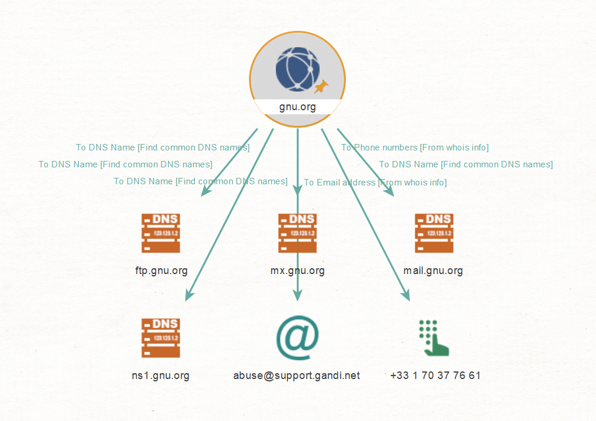
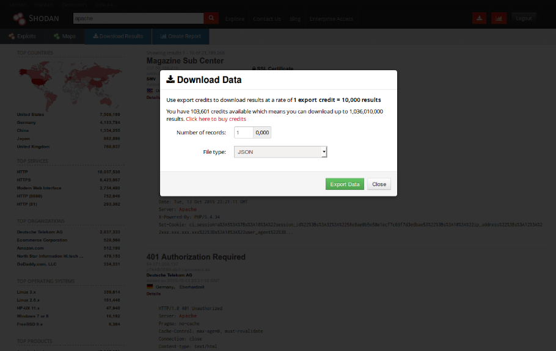
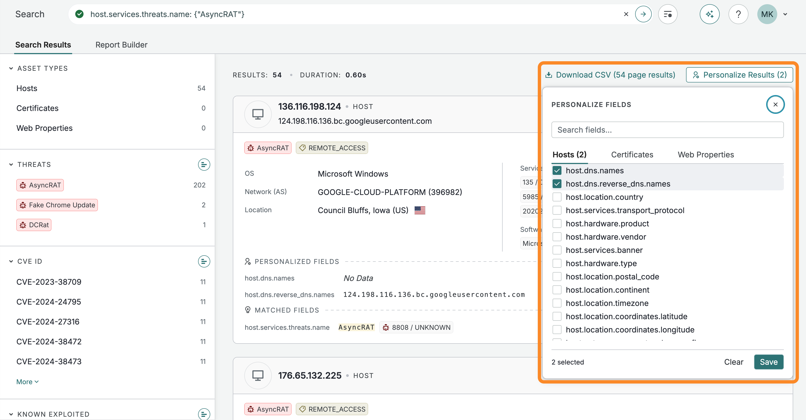
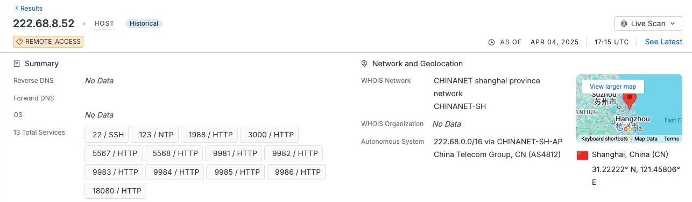

# Herramientas OSINT para infraestructura

Un dominio, una IP, una entrada de certificado y un servicio observado responden a preguntas diferentes. La elección de herramienta depende del dato necesario, de su fecha y de cómo se obtiene.

Primero se comparan opciones en [Operación Delta · Elección de herramientas](casos/operacion-delta/02-eleccion-de-herramientas.md), sin realizar consultas. La ejecución aparece después, en [Obtención con herramientas](casos/operacion-delta/04-obtencion-con-herramientas.md).

## Maltego: mapear relaciones de infraestructura

Maltego permite representar dominios, nombres DNS, direcciones y otras entidades en un grafo. Las transformaciones consultan fuentes para ampliar una relación; también se puede trabajar con datos aportados. El [tutorial de infraestructura del fabricante](https://www.maltego.com/blog/how-to-use-maltego-transforms-to-map-network-infrastructure-an-in-depth-guide/) muestra ese uso.



Fuente: Maltego, [*Charting My First Maltego Graph*](https://www.maltego.com/blog/beginners-guide-to-maltego-charting-my-first-maltego-graph/), 12 de marzo de 2024. Ejemplo externo a Operación Delta.

En la captura, un dominio se relaciona con varios nombres. La forma del grafo no demuestra propiedad común: se debe revisar qué fuente produjo cada enlace. Para comprender paleta, entidad y menú de transformaciones, consulta el [apartado de Maltego del Tema 3](../03-osint-personas-y-organizaciones/herramientas.md#maltego-relacionar-entidades-y-fuentes).

En Delta permite reunir DEL-D03 → DEL-D04 y separar `tienda-ajena.example`, aunque comparta IP. Antes de ampliar el mapa se revisan los datos que recibiría el proveedor de la transformación y si la consulta contacta con el objetivo. Una transformación no hereda autorización por aparecer en el menú.

**Cuándo encaja:** cuando interesa comparar relaciones y procedencias. **Límite:** el mapa organiza evidencias, no sustituye la validación del activo.

## SpiderFoot: automatizar obtención mediante módulos

SpiderFoot automatiza consultas y relaciona resultados procedentes de módulos. Un módulo define qué fuente utiliza, qué datos necesita y qué eventos puede producir. El [repositorio oficial del proyecto](https://github.com/smicallef/spiderfoot) describe la herramienta y sus opciones.

Su utilidad está en ejecutar de forma repetible un conjunto de consultas. Su riesgo metodológico es recoger demasiado, mezclar fuentes o realizar acciones que el alcance no permite. La palabra «OSINT» no garantiza que todos los módulos sean pasivos.

| Antes de ejecutar | Por qué importa |
|---|---|
| Tipo y valor de la entrada | Un dominio no es lo mismo que una organización o una IP |
| Módulos elegidos | Determinan qué se consulta realmente |
| API y fuentes utilizadas | Condicionan cobertura y datos enviados |
| Contacto con el objetivo | Distingue obtención por terceros de interacción directa |
| Límite de ampliación | Evita incorporar proveedores y terceros al encargo |

En Delta sería candidato si hubiera muchos nombres que contrastar con fuentes autorizadas. Para un único certificado puede resultar innecesario. No se ejecuta una configuración general sobre el dominio ficticio: primero se explica qué módulos responderían a la pregunta y cuáles quedarían excluidos. La instalación y sintaxis se comprueban en la versión disponible, sin asumir que una guía antigua sigue vigente.

## OWASP Amass: descubrir y relacionar activos

[OWASP Amass](https://github.com/owasp-amass/amass) se orienta al descubrimiento de activos y al mapa de superficie externa. Puede ayudar a reunir nombres y relaciones a partir de distintas fuentes. Se diferencia de un índice de servicios: su propósito es construir y ampliar un inventario, no solo mostrar una ficha ya recogida.

Hay que comprobar en la versión utilizada qué operaciones realizan las opciones elegidas. El alcance, las fuentes y las posibles interacciones se fijan antes de ejecutar. No se proporcionan comandos tomados de versiones anteriores como si fueran actuales.

En Delta encajaría para una revisión más amplia de nombres, si la empresa la autorizara. Para interpretar DEL-C02 basta con CT; no hace falta ampliar a un reconocimiento general. Esta comparación se trabaja en [Elección de herramientas](casos/operacion-delta/02-eleccion-de-herramientas.md).

## Shodan: consultar observaciones de servicios

Shodan indexa respuestas de servicios accesibles en Internet. Permite buscar por campos como IP, nombre y puerto. La unidad de información es el banner, que recoge parte de lo observado por el servicio. La [introducción a las consultas](https://help.shodan.io/the-basics/search-query-fundamentals) explica esa estructura.


Fuente: Shodan, [*Navigating the Website*](https://help.shodan.io/the-basics/navigating-the-website). Captura publicada en su documentación; la apariencia puede diferir de la interfaz disponible.

Identifica la caja de consulta y el acceso a resultados. Después hay que abrir una ficha, revisar puerto, protocolo, respuesta y fecha de observación. Un resultado reciente no es una prueba del estado del objetivo en este instante.

| Consulta orientativa | Necesidad |
|---|---|
| `hostname:DOMINIO_AUTORIZADO` | Buscar asociaciones de nombre |
| `ip:IP_OBSERVADA` | Consultar una dirección concreta |
| `ip:IP_OBSERVADA port:443` | Acotar al puerto previsto |

Los marcadores se sustituyen antes de ejecutar. La [referencia de filtros](https://www.shodan.io/search/filters) permite comprobar su disponibilidad. Las restricciones de cuenta deben distinguirse de un resultado vacío.



Fuente: Shodan, [misma guía de navegación](https://help.shodan.io/the-basics/navigating-the-website). La imagen permite diferenciar resultados conservados de una nueva obtención. La exportación y sus formatos dependen del acceso.

En Delta ayuda a interpretar DEL-S04. Consultar datos existentes no equivale a solicitar un escaneo nuevo: esta última acción queda fuera del encargo. **Vínculo con el caso:** [obtención](casos/operacion-delta/04-obtencion-con-herramientas.md#consultar-servicios-indexados) y [lectura posterior](casos/operacion-delta/05-servicios-indexados.md).

## Censys: consultar hosts, sitios y certificados

Censys permite consultar conjuntos de datos de hosts, propiedades web y certificados. Se selecciona el conjunto adecuado para la pregunta. La [guía de inicio](https://docs.censys.com/docs/platform-quickstart-guide) explica esas diferencias.



Fuente: Censys, [*Quick Start Guide*](https://docs.censys.com/docs/platform-quickstart-guide). La captura ilustra consulta, resultado y selección de campos. Su búsqueda de ejemplo y sus IP no forman parte del caso ni se ejecutan como práctica.

Lee la consulta en la parte superior, el tipo de activo y los campos mostrados. Un contador representa resultados del conjunto consultado, no activos propios confirmados.



Fuente: Censys, [misma guía](https://docs.censys.com/docs/platform-quickstart-guide). Resumen de un host del ejemplo documental; no describe a Dársena.

Para comparar con otro índice hay que conservar la fecha de la observación, protocolo y forma de asociación con el nombre. Que dos fichas compartan IP no garantiza que describan la misma aplicación.

Censys Platform utiliza [CenQL](https://docs.censys.com/docs/censys-query-language). Ejemplos de consulta:

```text
host.ip=IP_OBSERVADA
host.ip=IP_OBSERVADA and host.services.port=443
host.ip=IP_OBSERVADA and host.services: (port=443 and protocol=HTTP)
```

La agrupación obliga a que las condiciones correspondan al mismo servicio. Sin ella, varios campos pueden coincidir en servicios distintos del host. La sintaxis de Legacy Search es diferente.

En Delta permite comparar DEL-S01 y DEL-S06 por procedencia y fecha. El acceso o una exportación real preparada por el docente determina qué se puede consultar; no se exige contratar un plan.

## ICANN Lookup, DNS y crt.sh: resolver preguntas acotadas

| Recurso | Qué aporta | Qué no acredita |
|---|---|---|
| [ICANN Lookup](https://lookup.icann.org/en) | Datos de registro RDAP | Autoría del contenido o de una actividad |
| [Resolve-DnsName](https://learn.microsoft.com/en-us/powershell/module/dnsclient/resolve-dnsname) o dig | Respuesta DNS en una consulta | Propiedad de todos los servicios de la IP |
| [crt.sh: respuesta de ejemplo](https://crt.sh/?q=www.example.org&output=json) | Entradas CT y nombres de certificados | Servicio activo ni despliegue del certificado |

Un recurso sencillo puede ser la mejor elección para una pregunta concreta. Registro, DNS y CT se interpretan en el [Tema 4](README.md#whois-dns-y-certificados) antes de ejecutar las consultas del caso.

Para DNS se conservan nombre, tipo, valor, TTL y hora. Para CT se conserva entrada, certificado, nombres y fechas. La búsqueda de un nombre bajo el dominio puede plantearse con `%.DOMINIO_AUTORIZADO` en crt.sh. Las entradas repetidas no se cuentan como activos distintos.

El enlace de ejemplo devuelve JSON para `www.example.org`. Permite leer campos como `id`, `name_value`, `not_before`, `not_after` y `serial_number` sin depender de la página de inicio. La fecha de incorporación al registro se conserva si el detalle la facilita; no se sustituye por el inicio de validez del certificado. La interfaz web ofrece otra presentación de los datos; si limita consultas, se registra la limitación o se utiliza una salida fechada ya aportada.

## Wappalyzer y DevTools: reconocer señales de tecnología

[Wappalyzer](https://www.wappalyzer.com/apps/) infiere tecnologías a partir de señales. Las herramientas de desarrollo del navegador permiten leer directamente peticiones, cabeceras y respuesta HTML; la [guía de DevTools](https://developer.chrome.com/docs/devtools/network/) muestra dónde se encuentran esos datos.

La detección se contrasta con una señal concreta: cabecera, nombre de cookie, elemento HTML o ruta. Un intermediario puede cambiar las cabeceras y una aplicación puede imitar una señal. Detectar un producto no confirma versión, configuración ni vulnerabilidad.

En Delta se empieza con DEL-H01, sin abrir el servicio ficticio. Más adelante se examina una web propia o expresamente autorizada. Abrir la web contacta con el servicio; no es lectura de un índice pasivo.

## SecurityTrails: comparar DNS actual e histórico

[SecurityTrails](https://docs.securitytrails.com/docs/overview) permite consultar datos de dominios, DNS, IP y registro. Su valor para OSINT es comparar relaciones observadas en distintos momentos, cuando una respuesta DNS actual no basta para entender un cambio.

| Dato que interesa | Qué aporta | Reserva |
|---|---|---|
| Registros DNS | Destinos asociados a nombres | Hay que conservar tipo y fecha |
| Histórico de un registro | Cambios observados por la fuente | No cubre necesariamente todos los cambios |
| Subdominios conocidos | Candidatos para contrastar con inventario | Aparición no equivale a servicio actual |
| Relación con una IP | Contexto del alojamiento | La IP puede ser compartida o reutilizada |

Procedimiento: consulta el dominio autorizado, selecciona el tipo de registro y compara observaciones fechadas. Anota qué cambio sostiene el histórico y contrástalo con inventario o certificado. Si hay varias IP, no presupongas una migración completa sin más datos. La cobertura, el histórico visible y la API dependen del acceso; no se incluye una clave en el registro del estudiante.

En Delta encaja para la pregunta «¿qué destino tuvo legado antes de su retirada?». DEL-D ya proporciona una muestra ficticia: se interpreta sin intentar obtener datos de `darsena.example`. Compara esta herramienta con DNS actual en [Elección](casos/operacion-delta/02-eleccion-de-herramientas.md) y registra el uso sobre un objetivo real en [Históricos y páginas archivadas](casos/operacion-delta/04-obtencion-con-herramientas.md#históricos-y-páginas-archivadas).

## urlscan.io: leer observaciones archivadas de páginas web

[urlscan.io](https://urlscan.io/docs/search/) permite buscar resultados de visitas realizadas por su servicio. Una ficha puede mostrar la página, solicitudes de red y destinos contactados. **Buscar una ficha existente** y **enviar una URL para que se visite** son operaciones distintas. En el caso se consultan resultados ya publicados; no se solicita una visita nueva.

### Campos para acotar

| Campo | Ejemplo con marcador | Qué busca |
|---|---|---|
| `page.domain` | `page.domain:DOMINIO_AUTORIZADO` | Dominio de la página observada |
| `page.ip` | `page.ip:IP_AUTORIZADA` | IP de la página |
| `domain` | `domain:DOMINIO_AUTORIZADO` | Dominio contactado durante la visita, que puede ser un recurso externo |
| `date` | `page.domain:DOMINIO_AUTORIZADO AND date:>now-30d` | Resultados del periodo |

Los marcadores se sustituyen por referencias autorizadas. La [referencia de campos](https://urlscan.io/docs/search/) permite comprobar las diferencias: un dominio de analítica contactado no es el dominio de la página principal.

Para leer una ficha, conserva identificador y fecha, revisa URL inicial y destino tras las redirecciones y distingue servidor principal de recursos externos. Una captura demuestra lo que vio ese servicio en ese momento. No representa todos los usuarios ni acredita que el contenido siga publicado.

En Delta ayuda a interpretar una página histórica como DEL-S03 y las señales de DEL-H01. Se aplica en [Históricos y páginas archivadas](casos/operacion-delta/04-obtencion-con-herramientas.md#históricos-y-páginas-archivadas). Una URL con tokens o datos internos no se envía a un servicio público.

## VirusTotal: interpretar informes y relaciones de dominios

[VirusTotal](https://docs.virustotal.com/docs/searching) reúne informes y relaciones sobre archivos, URL, dominios e IP. La [referencia de dominios](https://docs.virustotal.com/reference/domains-object) describe datos como registro, resoluciones y certificados. Algunas funciones pertenecen a servicios de pago.

| Elemento del informe | Lectura adecuada | Lectura que se evita |
|---|---|---|
| Detecciones de proveedores | Opiniones o resultados registrados, con su fecha | «Un contador demuestra un delito» |
| Resoluciones DNS | Relaciones observadas entre nombre e IP | «Todas las direcciones pertenecen al mismo titular» |
| Certificados | Información vinculada al dominio | «El certificado garantiza que la web es segura» |
| Archivos relacionados | Relación descrita por el informe | «Todo archivo relacionado fue publicado por la organización» |

Antes de consultar hay que revisar qué acción provoca la interfaz. La guía de búsqueda advierte de que los indicadores consultados o enviados por la web pueden ser analizados e incorporados al conjunto de datos. Por tanto, no se presenta cualquier búsqueda web como pasiva ni se envían indicadores internos o personales.

Para este caso se puede interpretar un informe ya preparado por el docente, con referencia y fecha, o consultar un indicador público cuando el alcance permita ese procesamiento. Se registra procedencia, relación y límite; no se solicita un nuevo análisis de un objetivo ajeno ni se descargan muestras de malware.

En Delta encaja para comparar relaciones y reputación como contexto, sin convertir DEL-S04 en una intrusión. La configuración y el modo de consulta se justifican en [Elección de herramientas](casos/operacion-delta/02-eleccion-de-herramientas.md); las evidencias se conservan en [Obtención](casos/operacion-delta/04-obtencion-con-herramientas.md#contrastar-un-informe-de-reputación).

## Elegir por la pregunta

| Pregunta | Primera opción posible | Cuándo ampliar |
|---|---|---|
| ¿Qué consta en el registro? | RDAP | Si hace falta otra fuente de titularidad o uso |
| ¿A qué destino se asocia el nombre? | DNS | Si se necesita un histórico |
| ¿Cómo cambió el destino observado? | SecurityTrails | Si hay que contrastar otro histórico |
| ¿Qué página y recursos vio un servicio? | urlscan.io, resultado existente | Si hay que comparar otra fecha |
| ¿Qué relaciones y reputación constan en un informe? | VirusTotal | Si el alcance permite el modo de consulta |
| ¿Qué nombres aparecen en certificados? | CT | Si se debe contrastar inventario |
| ¿Qué servicio observó un tercero? | Shodan o Censys | Si interesa comparar cobertura y fecha |
| ¿Cómo represento las relaciones? | Maltego | Si el grafo ayuda a interpretar el conjunto |
| ¿Cómo automatizo una obtención amplia? | SpiderFoot o Amass | Solo con alcance y configuración revisados |

Los [créditos de las capturas](../../imagenes/03-04-capturas.md) identifican publicación e imagen de origen. La elección razonada precede a la ejecución.
